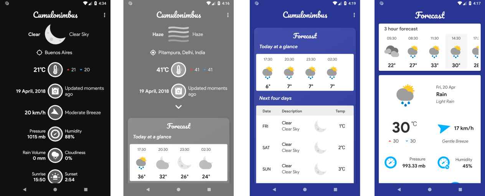

### A Work in progress weather app
Cumulonimbus is a simple and succint weather app with a fresh bold design, inspired by Material Design (but doesn't adhere to its guidelines).

Check out more screenshots in the [here](assets/)

Things to note:
- The weather data is requested from *Open Weather Map*. However the free API package is used, so it won't scale properly in its current condition, although options are being researched on.
- Efforts have been made to use the latest additions to the Android libraries, and other open source libraries are being looked at as well 
- The goal is to make the UI clean and responsive, so themes and animated UI changes are a priority.
- The app is nearing a release on Github and after maturing more, will be added to the Play Store eventually.

TO-DO :
1. Add tablet layout
2. Add user friendly tutorials
3. Widgets
4. Add Air Quality Index

Credits:
- The weather icons are colored and modified versions of [**Climacons**](https://github.com/AdamWhitcroft/climacons) from Adam Whitcroft.